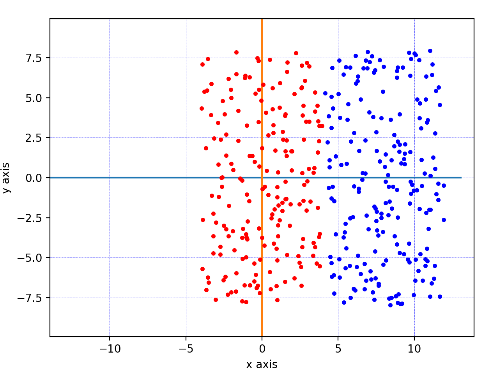
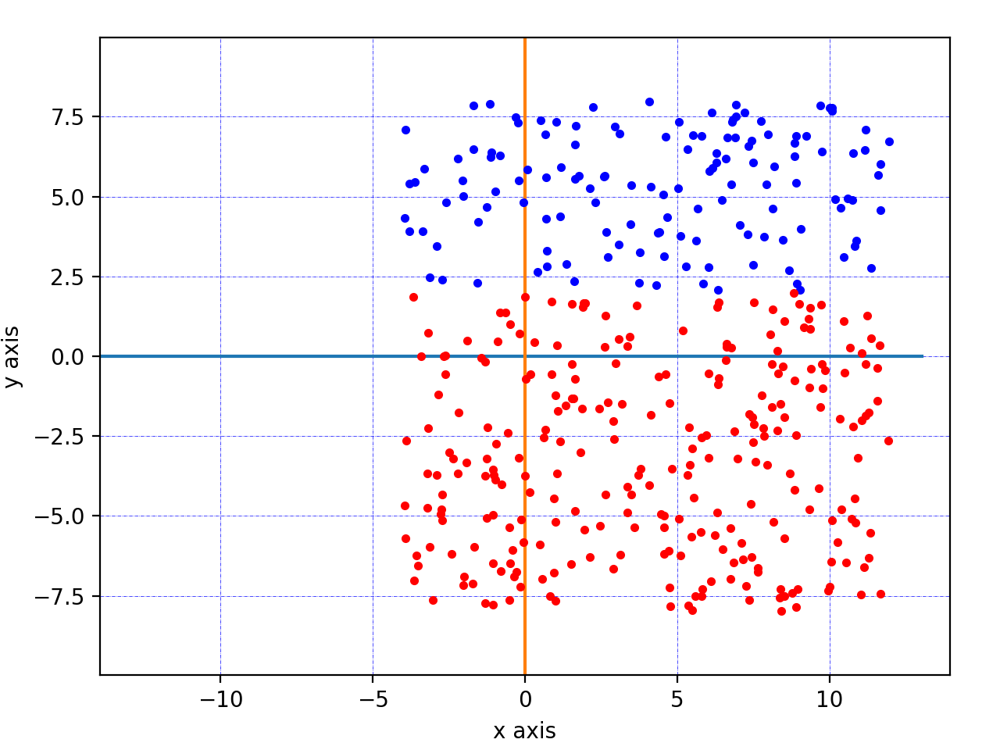
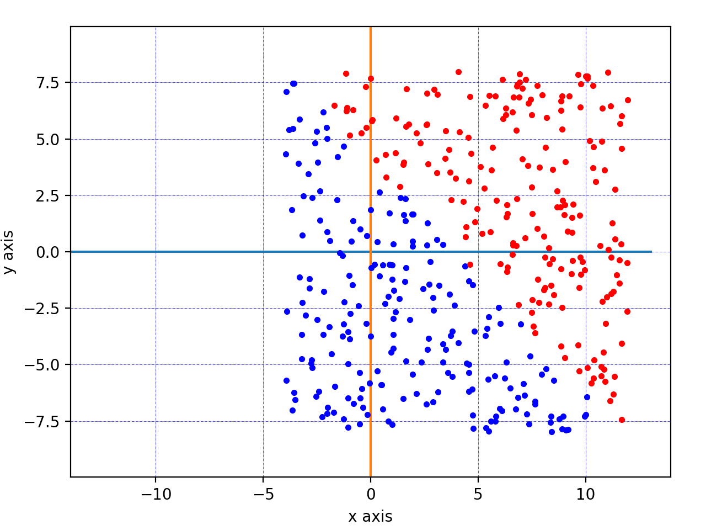
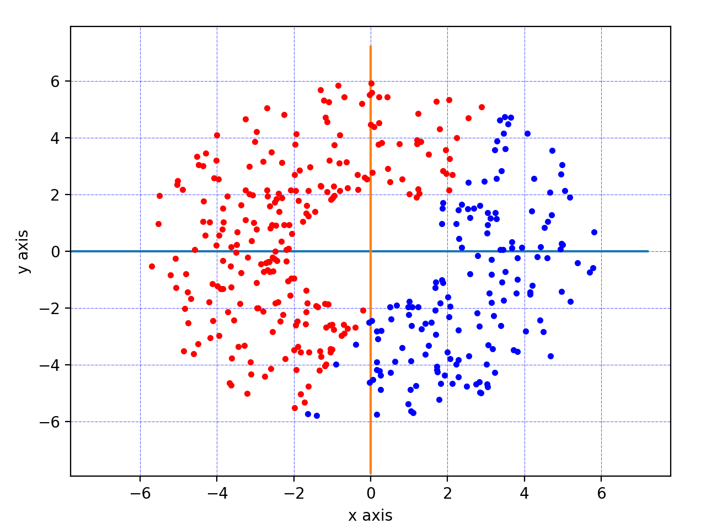
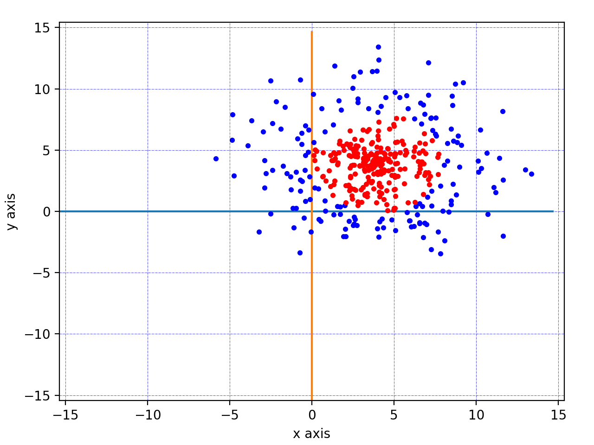
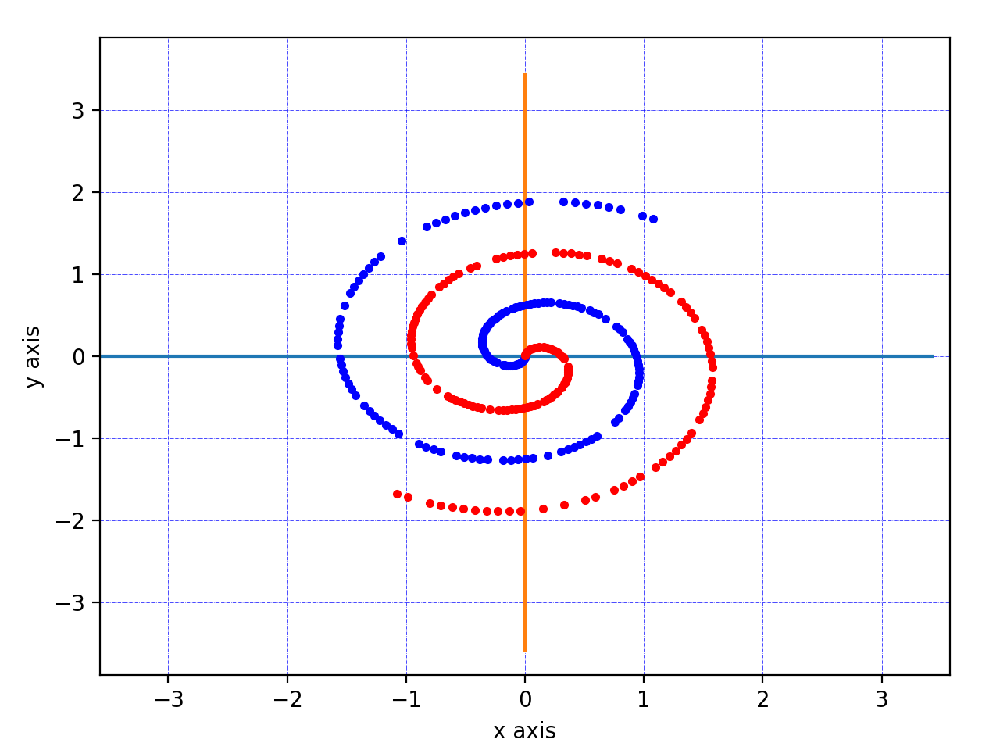
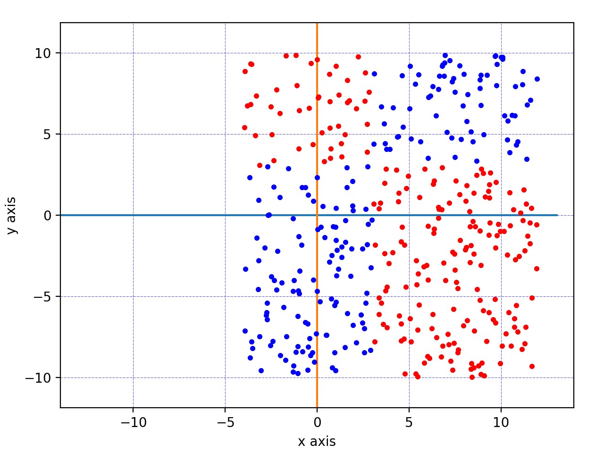
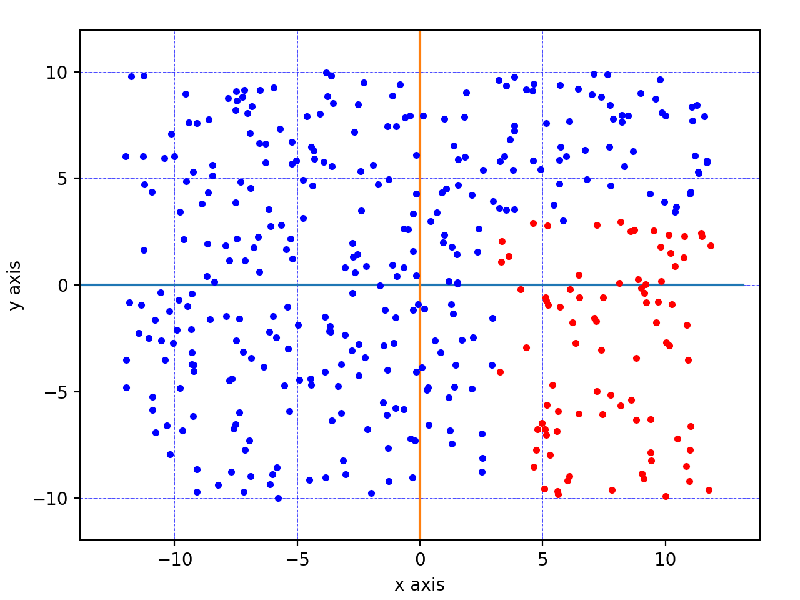
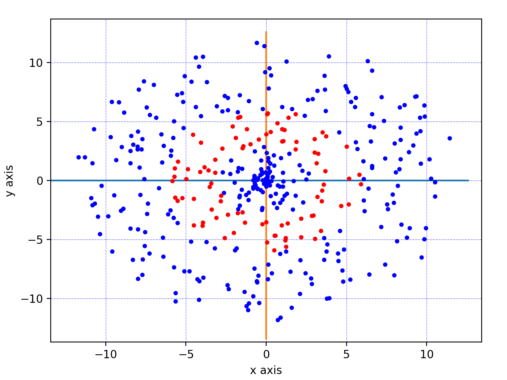
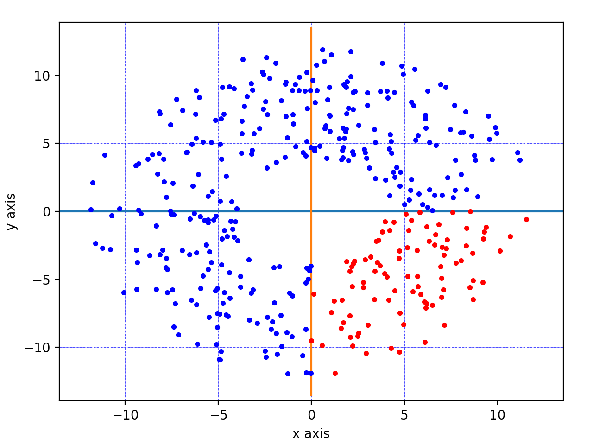

## Getting started with Tensorflow 2.0
This is a collection of simple classification models in Tensorflow 2.0.

### Requirement
```
numpy==1.18.1
python==3.7.0
tensorflow==2.0
```
### How to use
Training & Prediction can be run as follows:    
`python tf_keras_0.py train`  
`python tf_keras_0.py predict`

### Datasets
. |  .
:---: | :---: |
 | 
data1_1.csv | data1_2.csv
 | 
data1_3.csv | data1_4.csv
 | 
data2_1.csv | data2_2.csv
 | 
data2_3.csv | data3_1.csv
 | 
data3_2.csv | data3_3.csv

* tf_keras_0.py was designed to solve       data1_1.csv, data1_2.csv, data1_3.csv, data1_4.csv
* tf_keras_1.py was designed to solve data2_1.csv, data2_3.csv
* tf_keras_2.py was designed to solve data2_2.csv, data2_3.csv
* tf_keras_3.py was designed to solve data3_1.csv, data3_3.csv
* tf_keras_4.py was designed to solve data3_2.csv
